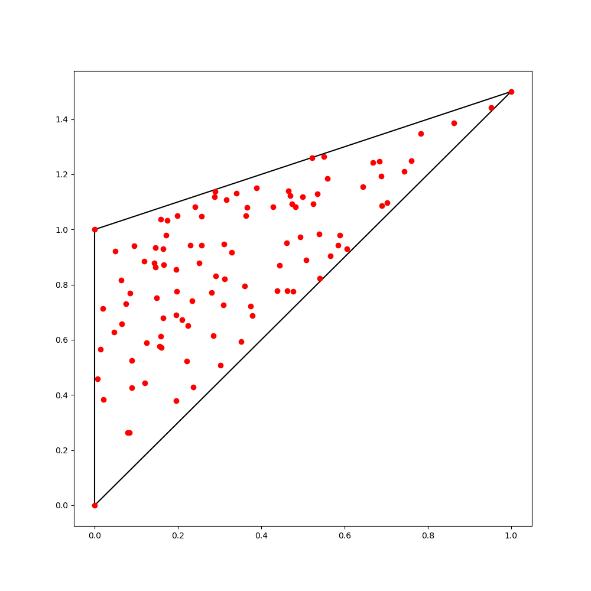
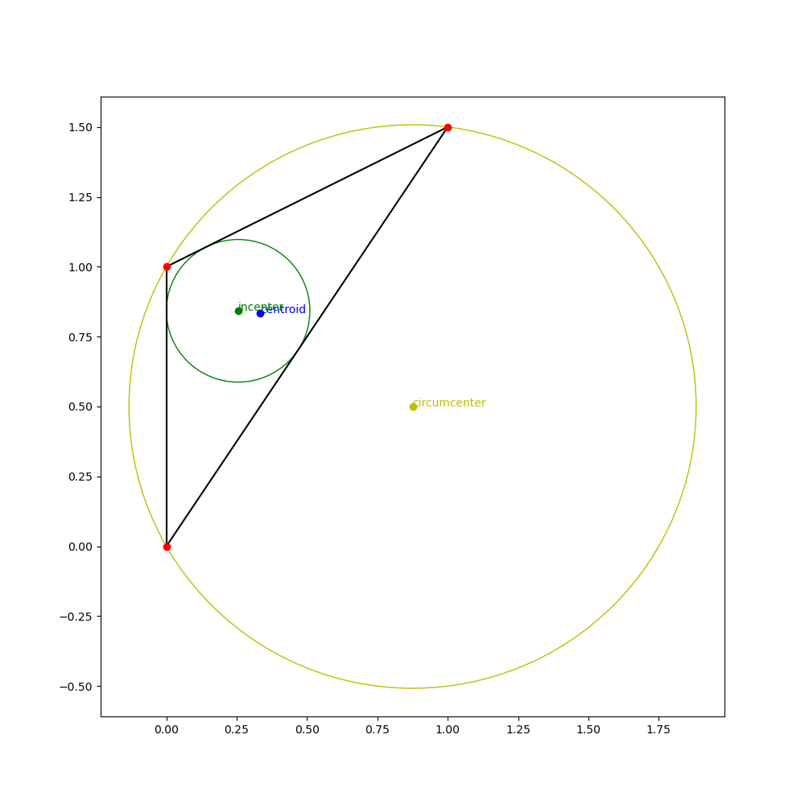
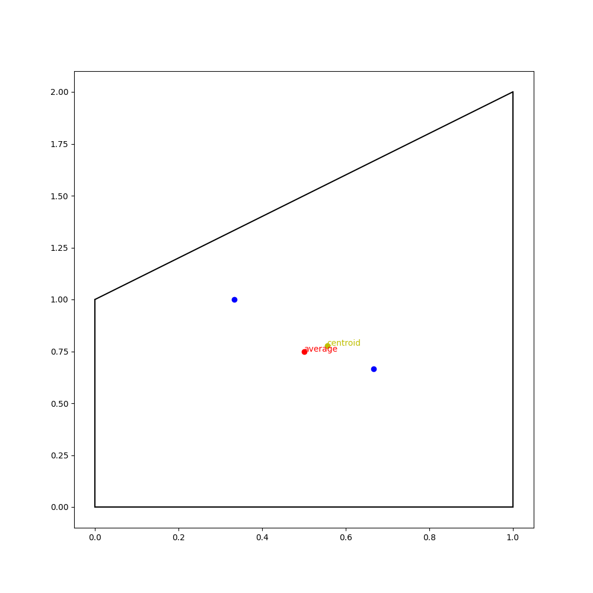
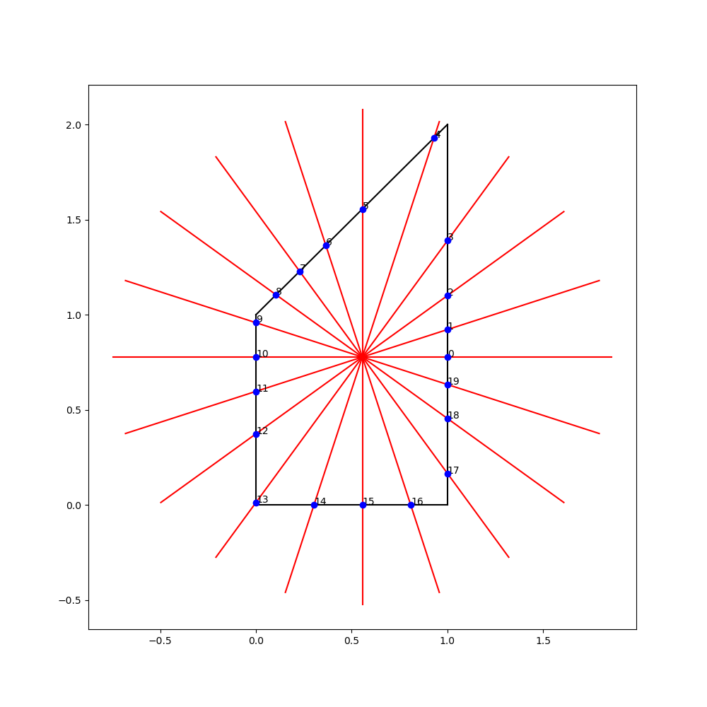
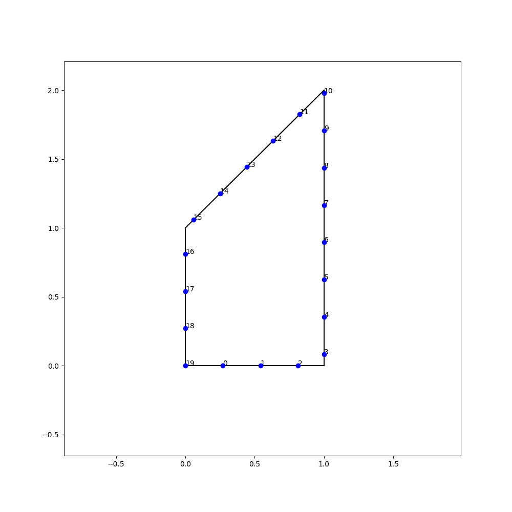
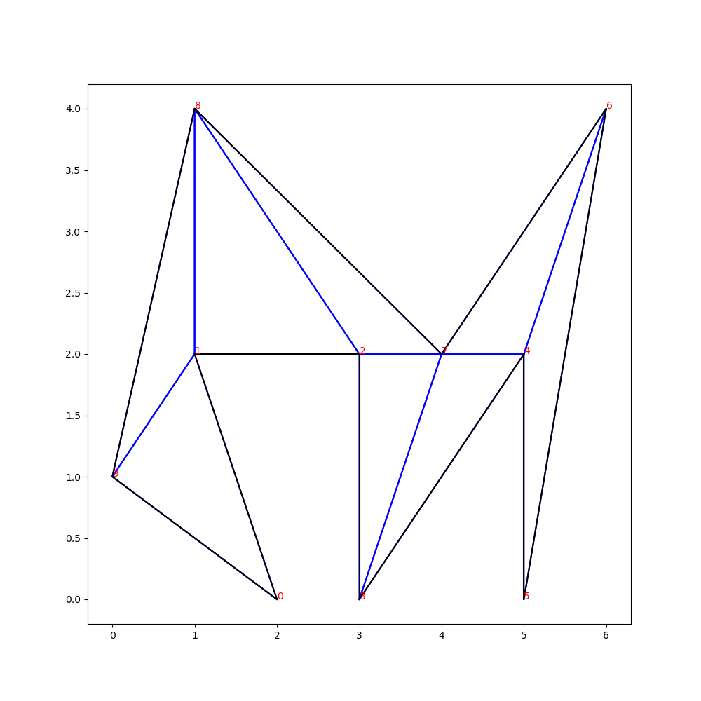
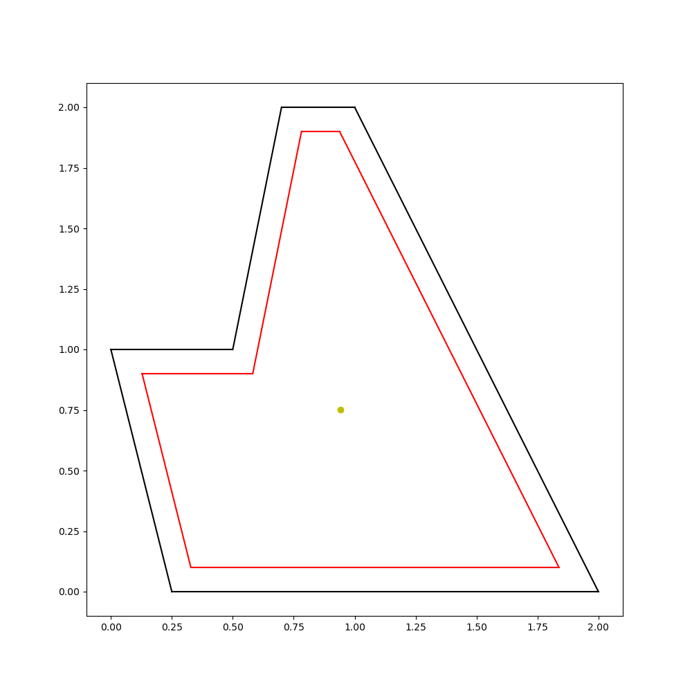
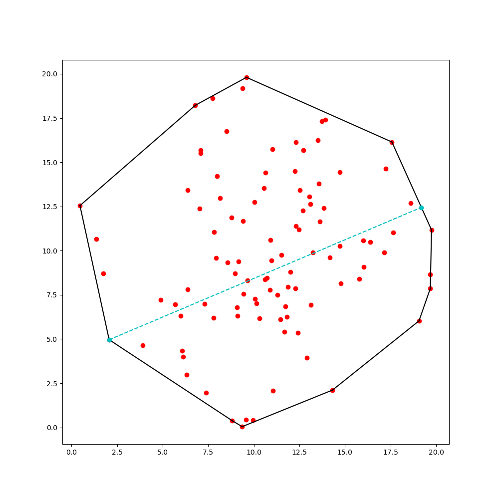
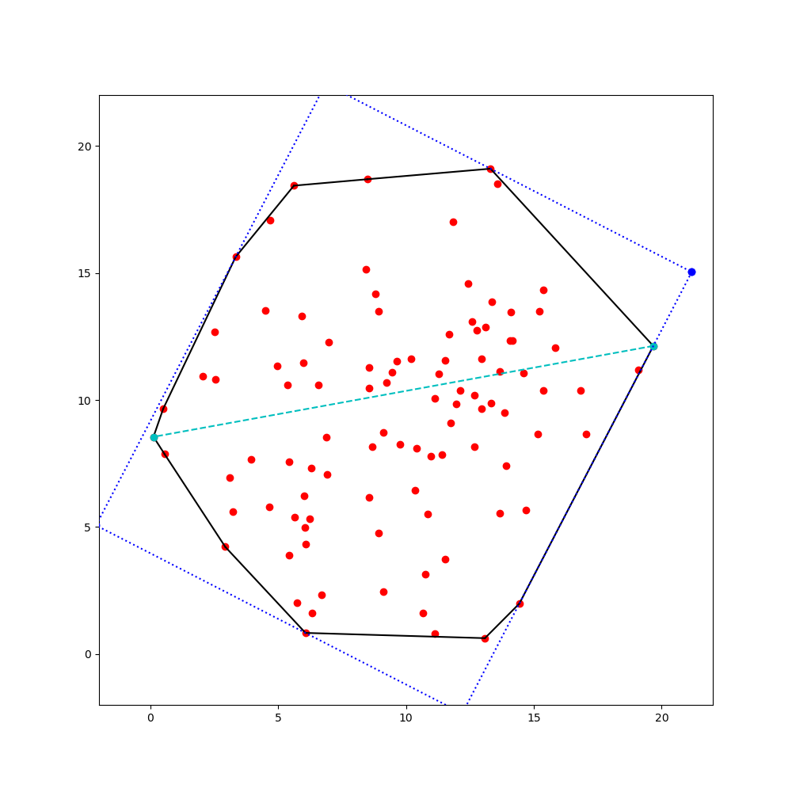

### Triangle
#### Uniform sample in triangle

#### Circles of triangle

### Polygon
#### Polygon Centroid

#### Polygon division

#### Polygon earcut

#### Polygon offset

### ConvexHull
#### Diameter

#### Minimal bounding box

